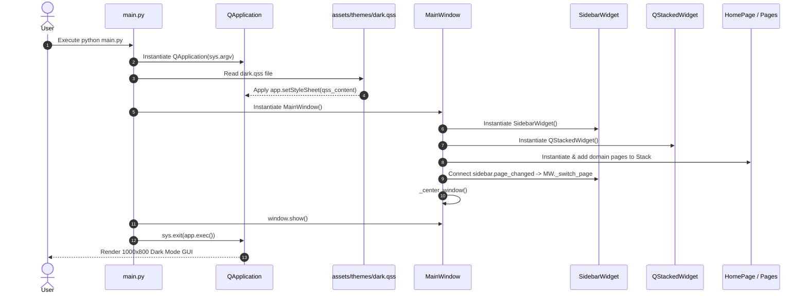
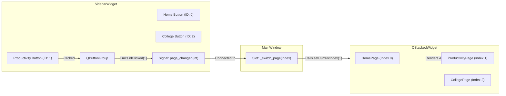
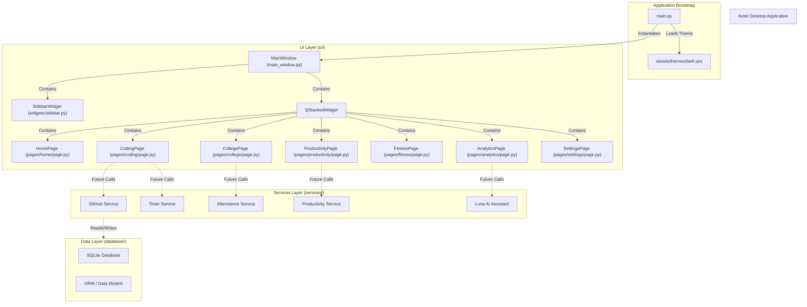

# 🌼 Aster System Architecture Documentation (Version 0.1)

Welcome to the Aster developer documentation! This document provides a comprehensive technical overview of Aster's architecture, design decisions, component relationships, and extensibility guidelines for software engineers working on the project.

---

## 1. Architecture Overview

### Overall Architecture
Aster is built as a modular desktop application in **Python 3** using **PySide6** (Qt for Python). The system adheres to a **Layered Separation of Concerns** architecture, decoupling the User Interface (UI), Business Services, Data Persistence, and Application Utilities.

```
+-------------------------------------------------------------------+
|                        User Interface Layer                       |
|  [main.py] ---> [MainWindow] <---> [SidebarWidget]                |
|                               <---> [QStackedWidget]              |
|                                       ├── [HomePage]              |
|                                       ├── [ProductivityPage]      |
|                                       ├── [CollegePage]           |
|                                       ├── [CodingPage]            |
|                                       ├── [FitnessPage]           |
|                                       ├── [AnalyticsPage]         |
|                                       └── [SettingsPage]          |
+-------------------------------------------------------------------+
|                        Business Services Layer                    |
|  [GitHub]  [Timer]  [Attendance]  [Productivity]  [Analytics]    |
+-------------------------------------------------------------------+
|                        Data Persistence Layer                     |
|  [SQLite Database] <---> [ORM / Data Models & Migrations]         |
+-------------------------------------------------------------------+
|                        Asset & Utility Support                    |
|  [QSS Dark Theme]   [Icons / Fonts]   [Helpers & Test Suite]      |
+-------------------------------------------------------------------+
```

### Design Philosophy
1. **Strict Separation of Concerns:** UI widgets handle layout and user interaction only. Business computations, background tasks, and database queries must never reside inside UI event handlers.
2. **Predictable Component Ownership:** Parent widgets own child widgets explicitly. Communication flows downward via methods and upward via Qt **Signals and Slots**.
3. **Simplicity Over Cleverness:** Avoid premature abstractions or complex frameworks. Standard PySide6 widgets, clean class inheritance, and simple standard library utilities are preferred.
4. **Folder-Based Domain Isolation:** Every domain (Home, Productivity, College, Coding, Fitness, Analytics, Settings) resides in its own folder to enable localized growth without polluting global namespaces.

### Why This Architecture Was Chosen
Aster is designed to grow with its developer throughout an engineering journey. A monolithic single-file script becomes unmaintainable quickly. Conversely, an over-engineered framework with excessive boilerplate creates friction. This layered, domain-isolated structure strikes the perfect balance between zero-friction development now and clean long-term maintainability.

---

## 2. Folder Structure

The repository is structured into distinct top-level directories, each with a clear, single responsibility:

```
Aster/
├── main.py                 # Application entry point
├── requirements.txt        # Pinned project dependencies
├── AGENTS.md               # AI Agent collaboration guidelines
├── README.md               # High-level project summary
│
├── ui/                     # User Interface Layer
│   ├── main_window.py      # Core window container & layout controller
│   ├── widgets/            # Reusable UI widgets
│   │   ├── sidebar.py      # Navigation sidebar widget
│   │   └── .gitkeep
│   ├── pages/              # Domain-specific page views (folder-based)
│   │   ├── home/page.py
│   │   ├── productivity/page.py
│   │   ├── college/page.py
│   │   ├── coding/page.py
│   │   ├── fitness/page.py
│   │   ├── analytics/page.py
│   │   └── settings/page.py
│   └── dialogs/            # Modal dialogs & popup windows
│       └── .gitkeep
│
├── database/               # Data Persistence Layer (SQLite & Models)
│   ├── .gitkeep
│   └── migrations/
│       └── .gitkeep
│
├── services/               # Independent Business Logic Services
│   ├── github/.gitkeep
│   ├── timer/.gitkeep
│   ├── attendance/.gitkeep
│   ├── productivity/.gitkeep
│   └── analytics/.gitkeep
│
├── assets/                 # Non-code static assets
│   ├── icons/.gitkeep
│   ├── images/.gitkeep
│   ├── fonts/.gitkeep
│   └── themes/
│       └── dark.qss        # Sleek dark mode QSS stylesheet
│
├── utils/                  # Shared cross-cutting helper functions
│   └── .gitkeep
│
├── tests/                  # Automated test suite
│   ├── test_foundation.py
│   └── .gitkeep
│
└── docs/                   # Developer documentation & roadmaps
    ├── ROADMAP.md
    ├── STRUCTURE.md
    └── ARCHITECTURE.md
```

### Folder Responsibilities Summary
- **`ui/`**: Houses all Qt widgets, layouts, stacked pages, and visual dialogs.
- **`database/`**: Manages SQLite connections, SQL schema scripts, ORM data models, and database migration files.
- **`services/`**: Encapsulates core business algorithms (Pomodoro state machines, attendance percentage calculations, GitHub API clients, analytics processing).
- **`assets/`**: Contains visual themes (QSS stylesheets), icons (SVG/PNG), custom fonts, and images.
- **`utils/`**: Houses stateless helper functions (date formatters, string parsers, validation helpers).
- **`tests/`**: Contains automated unit and integration tests written using standard `unittest` / `pytest`.
- **`docs/`**: Developer documentation, architecture specs, and feature roadmaps.

---

## 3. File-by-File Breakdown

### Core Entry Point & Configuration

#### [main.py](file:///d:/life_dashboard/Aster/main.py)
- **Purpose:** Serves as the bootstrap entry point for the Aster application.
- **Responsibilities:**
  - Instantiates `QApplication(sys.argv)`.
  - Sets application metadata (`ApplicationName`, `OrganizationName`).
  - Reads and applies the QSS dark mode stylesheet from `assets/themes/dark.qss`.
  - Instantiates `MainWindow`, displays it, and starts the Qt event loop (`sys.exit(app.exec())`).
- **Important Functions:**
  - `load_stylesheet(app: QApplication)`: Resolves theme file paths relative to `__file__` and applies standard QSS rules.
  - `main()`: Orchestrates execution.
- **Why It Exists:** Provides a single, clean starting point for launching Aster from the command line or desktop launcher.

#### [requirements.txt](file:///d:/life_dashboard/Aster/requirements.txt)
- **Purpose:** Tracks exact pinned third-party dependencies.
- **Responsibilities:** Ensures consistent, reproducible installations across different development environments.
- **Contents:** `PySide6==6.8.2.1` (Pinned for Python 3.13 compatibility).
- **Why It Exists:** Guarantees environment stability.

---

### UI Core Widgets & Main Window

#### [ui/main_window.py](file:///d:/life_dashboard/Aster/ui/main_window.py)
- **Purpose:** Core top-level window container (`MainWindow`).
- **Responsibilities:**
  - Controls default window geometry (**1000x800**) and minimum bounds (**900x650**).
  - Centers the window on the active desktop screen on startup.
  - Assembles the root layout: `SidebarWidget` on the left and `QStackedWidget` content area on the right.
  - Instantiates and registers all 7 domain pages into `QStackedWidget`.
  - Connects sidebar navigation signals (`page_changed`) to stacked page index switching (`setCurrentIndex`).
- **Important Classes:** `MainWindow(QMainWindow)`
- **Important Methods:**
  - `_init_ui()`: Constructs central widget, layout, sidebar, stacked widget, and connects signals.
  - `_switch_page(index: int)`: Handles page switching logic safely.
  - `_center_window()`: Calculates geometry offsets to center the window dynamically on screen.
- **Why It Exists:** Acts as the primary UI coordinator connecting navigation events with main content displays.

#### [ui/widgets/sidebar.py](file:///d:/life_dashboard/Aster/ui/widgets/sidebar.py)
- **Purpose:** Dedicated navigation sidebar widget (`SidebarWidget`).
- **Responsibilities:**
  - Displays the brand header (`🌼 Aster`).
  - Renders a vertical list of exclusive checkable navigation buttons for all domains.
  - Emits custom Qt Signal `page_changed(int)` whenever the user selects a tab.
  - Provides programmatic active tab updating (`set_active_index(index)`).
- **Important Classes:** `SidebarWidget(QWidget)`
- **Important Signals:** `page_changed = Signal(int)`
- **Important Methods:**
  - `_init_ui()`: Creates buttons and button group (`QButtonGroup`).
  - `_on_button_clicked(page_index: int)`: Intercepts internal button clicks and emits `page_changed`.
  - `set_active_index(index: int)`: Programmatically updates checked button state.
- **Why It Exists:** Encapsulates all navigation sidebar rendering and state logic into a reusable, self-contained widget.

---

### Domain Pages (`ui/pages/<domain>/page.py`)

Each domain page is built as an independent `QWidget` subclass inside its own folder module:

#### [ui/pages/home/page.py](file:///d:/life_dashboard/Aster/ui/pages/home/page.py)
- **Class:** `HomePage(QWidget)`
- **Purpose:** Displays the home dashboard, welcome greeting, and system status card.

#### [ui/pages/productivity/page.py](file:///d:/life_dashboard/Aster/ui/pages/productivity/page.py)
- **Class:** `ProductivityPage(QWidget)`
- **Purpose:** Placeholder view outlining planned features for Version 0.2 (To-Do, Daily Goals, Notes, Pomodoro).

#### [ui/pages/college/page.py](file:///d:/life_dashboard/Aster/ui/pages/college/page.py)
- **Class:** `CollegePage(QWidget)`
- **Purpose:** Placeholder view outlining planned features for Version 0.3 (Timetable, Attendance, Assignments, Exams).

#### [ui/pages/coding/page.py](file:///d:/life_dashboard/Aster/ui/pages/coding/page.py)
- **Class:** `CodingPage(QWidget)`
- **Purpose:** Placeholder view outlining planned features for Version 0.4 (Coding Timer, Project Tracker, GitHub Integration).

#### [ui/pages/fitness/page.py](file:///d:/life_dashboard/Aster/ui/pages/fitness/page.py)
- **Class:** `FitnessPage(QWidget)`
- **Purpose:** Placeholder view outlining planned features for Version 0.5 (Workout Log, Weight Tracker, Progress).

#### [ui/pages/analytics/page.py](file:///d:/life_dashboard/Aster/ui/pages/analytics/page.py)
- **Class:** `AnalyticsPage(QWidget)`
- **Purpose:** Placeholder view outlining planned features for Version 0.6 & Version 0.7 (Reports, Charts, Luna AI).

#### [ui/pages/settings/page.py](file:///d:/life_dashboard/Aster/ui/pages/settings/page.py)
- **Class:** `SettingsPage(QWidget)`
- **Purpose:** Settings view displaying application environment info and active configuration details.

---

### Assets & Themes

#### [assets/themes/dark.qss](file:///d:/life_dashboard/Aster/assets/themes/dark.qss)
- **Purpose:** Central QSS (Qt Style Sheet) rules.
- **Responsibilities:** Applies dark background color tokens (`#121214`, `#1A1A1E`, `#1E1E24`), violet accent colors (`#7C3AED`, `#C4B5FD`), typography styles, card borders, and custom dark scrollbars across all Qt widgets.

---

### Automated Tests

#### [tests/test_foundation.py](file:///d:/life_dashboard/Aster/tests/test_foundation.py)
- **Purpose:** Unit test suite for Version 0.1 foundation validation.
- **Responsibilities:** Validates `MainWindow` title, default dimensions (1000x800), stacked page count (7), and page switching signals using `unittest`.

---

## 4. Component Relationships

### Application Startup Flow



### Signal & Slot Page Switching Communication



---

## 5. Design Decisions

### 1. `QStackedWidget` for Main Content Area
- **Decision:** Use `QStackedWidget` as the primary page container inside `MainWindow`.
- **Why Chosen:** Provides zero-flicker, instant switching between stacked widgets while keeping each page instance active in memory.
- **Advantages:** Low latency navigation, clean separation of individual page codebases, built-in index management.
- **Alternatives Considered:**
  - *Dynamic instantiation on click (creating widgets on demand and destroying old ones):* Rejected because re-instantiating complex pages causes noticeable UI delay and destroys temporary UI state.
  - *`QTabWidget`:* Rejected because standard tab bars conflict with our custom sidebar UI design requirement.

### 2. Dedicated `SidebarWidget` Component
- **Decision:** Extract navigation sidebar into its own widget subclass (`SidebarWidget`) instead of building it directly inside `MainWindow`.
- **Why Chosen:** Encapsulates button group management, active tab state styling, and layout inside a single component.
- **Advantages:** Keeps `MainWindow` lean and makes the sidebar testable and refactorable independently.
- **Alternatives Considered:**
  - *Inlining buttons directly inside `MainWindow`:* Rejected as it leads to bloated, multi-hundred-line main window files ("God objects").

### 3. Centralized QSS Dark Theme (`dark.qss`)
- **Decision:** Use a single Qt Style Sheet (`assets/themes/dark.qss`) loaded at runtime.
- **Why Chosen:** Decouples styling rules entirely from Python code. Colors, fonts, padding, and borders can be tweaked without altering python files.
- **Advantages:** Clean CSS-like syntax, uniform aesthetic across all widgets, easy support for future theme toggling (e.g. Light mode).
- **Alternatives Considered:**
  - *Hardcoding widget colors via inline `.setStyleSheet(...)` in Python:* Rejected because it scatters magic color strings across dozens of files.
  - *Palette mutation via `QPalette`:* Rejected because `QPalette` behavior varies across OS platform styles (Windows Native vs macOS vs Fusion).

### 4. Folder-Based Page Structure (`ui/pages/<domain>/page.py`)
- **Decision:** Structure pages as `ui/pages/home/page.py` instead of a flat list (`ui/pages/home_page.py`).
- **Why Chosen:** Allows each domain page to grow natively. When a domain expands in future versions (e.g., adding sub-widgets, custom cards, or local helpers), those extra files can sit cleanly inside `ui/pages/productivity/widgets/` without polluting `ui/pages/`.

---

## 6. Extensibility: How to Add Future Features

### 1. Adding a New Page View
To add a new page (e.g., a custom `Journal` page):
1. Create directory `ui/pages/journal/` and file `ui/pages/journal/page.py`.
2. Define class `JournalPage(QWidget)` with `_init_ui()`.
3. In `ui/widgets/sidebar.py`, add `("📓  Journal", 7)` to `NAV_ITEMS`.
4. In `ui/main_window.py`, import `JournalPage`, instantiate `self.journal_page = JournalPage()`, and add it to `self.stacked_widget.addWidget(self.journal_page)`.

### 2. Connecting Database Infrastructure (Planned for Version 0.2+)
1. Create SQLite connection manager in `database/database.py`.
2. Define data models / table schemas in `database/models.py`.
3. Keep database queries inside Repository classes (e.g. `database/repositories/task_repository.py`), which are called exclusively by `services/`.

### 3. Adding Business Services (e.g. Timer or GitHub)
1. Write pure Python classes inside `services/<domain>/service.py` (e.g. `services/timer/pomodoro.py`).
2. Use Qt Signals or standard callbacks to communicate state changes to the UI layer without importing PySide6 widgets inside the service layer.

### 4. Future Luna AI Assistant Integration (Version 0.7)
1. Luna will exist as an independent service module (`services/analytics/luna_engine.py`).
2. Luna reads aggregate data from SQLite via database repositories, runs analysis/summarization, and returns structured insight objects to the UI.

---

## 7. Current Limitations

Version 0.1 intentionally focuses strictly on **Application Foundation**:
- **Static Content:** Page views currently display placeholder cards outlining planned version features.
- **No Persistence:** SQLite connection setup and migrations are scheduled for Version 0.2.
- **Single Theme:** Sleek Dark Mode is currently the default theme.
- **No Background Threading:** Async background workers (`QThread` / `QThreadPool`) are not yet required as no network or heavy disk I/O is performed in Version 0.1.

---

## 8. Future Refactoring Opportunities

As Aster grows, the following architectural enhancements should be considered:

1. **Dynamic Page Registry / Router:** Replace manual `stacked_widget.addWidget()` calls in `MainWindow` with a dynamic router/registry pattern that automatically loads pages defined in a configuration mapping.
2. **Central Theme Manager:** Create `services/theme_service.py` to allow live runtime theme switching (Dark / Light / High Contrast) and QSS hot-reloading during development.
3. **QThread Worker Pools for API Calls:** When GitHub integration (Version 0.4) is introduced, network requests must run on `QThread` instances using Qt Signals to avoid blocking the main UI event loop.

---

## 9. Architecture Diagrams

### Overall Component Architecture



---

## 10. Developer Notes & Guidelines

- **Never perform blocking network/disk operations on the main thread:** Always offload slow calls to `QThread`.
- **Use Qt Properties for QSS styling:** Apply `.setProperty("class", "card")` on custom widgets to target them via QSS without hardcoding inline style strings.
- **Maintain Test Suite Coverage:** Add corresponding test cases in `tests/` whenever new widgets or services are introduced.
- **Virtual Environment:** Always run commands within the `.venv` virtual environment:
  ```powershell
  .\.venv\Scripts\python.exe main.py
  ```

---

## 11. Post-Implementation Reflections

Reflecting on the successful implementation of Version 0.1:

1. **Folder-Based Pages Decision:** Using `ui/pages/<domain>/page.py` proved to be an excellent early choice. It already provides a clean boundary for upcoming domain widgets without polluting `ui/`.
2. **QSS Theme Performance:** Qt QSS stylesheets render cleanly with minimal overhead. The dark theme palette provides high contrast and a modern aesthetic out of the box.
3. **Future Enhancement Recommendation:** As domain services are added in Version 0.2, introducing a lightweight Dependency Injection / Service Locator container will make passing database and service references to page controllers completely seamless.
 ## Non-Goals

The following are intentionally out of scope for Version 0.1:

- Database integration
- Background workers
- GitHub API communication
- Machine learning
- Cloud synchronization
- User authentication