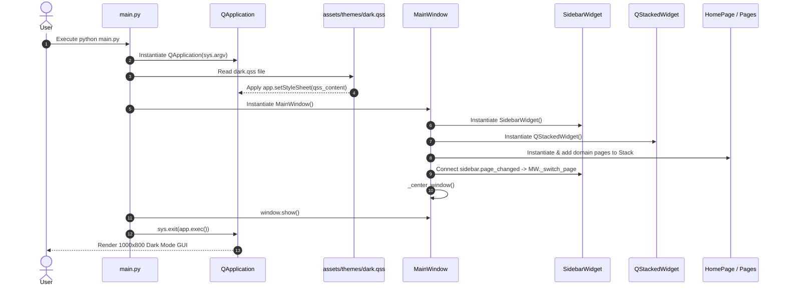
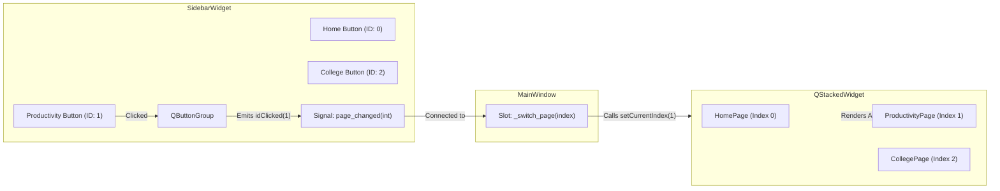
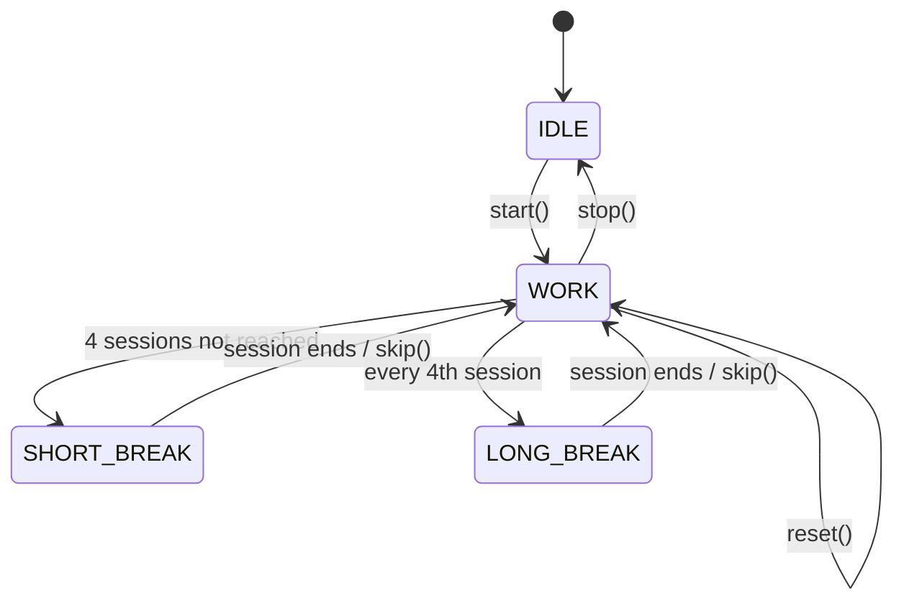
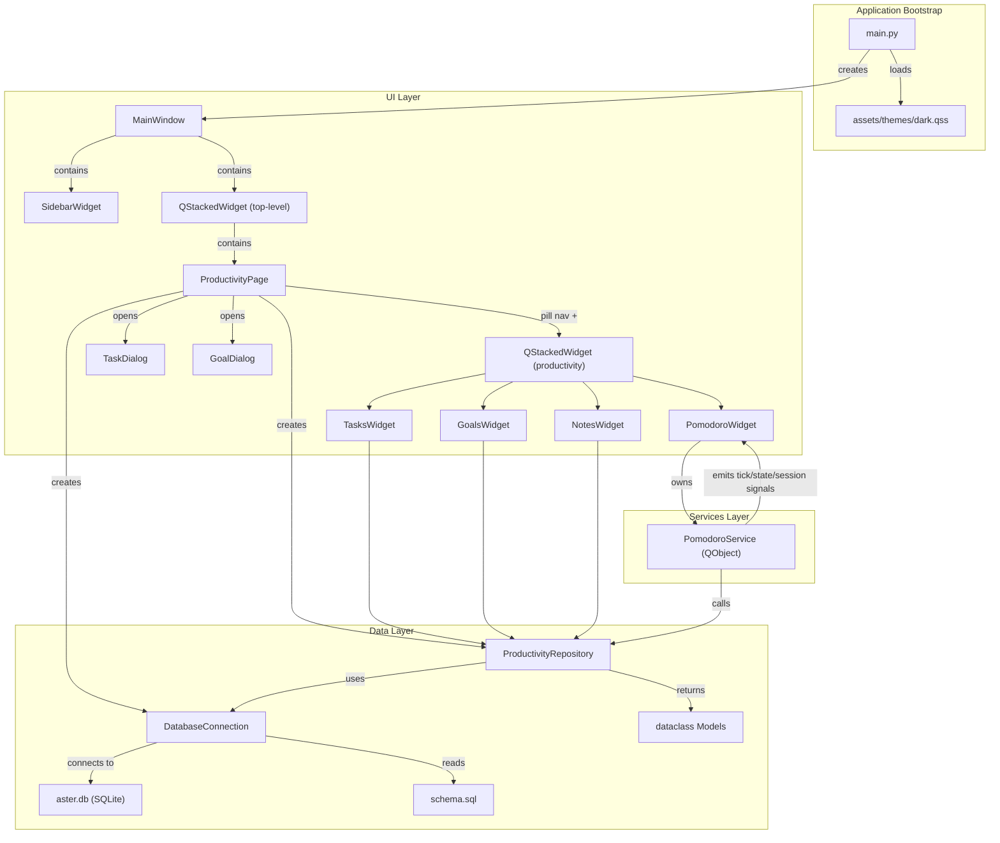

# 🌼 Aster System Architecture Documentation (Versions 0.1 → 0.5)

Welcome to the Aster developer documentation! This document provides a comprehensive technical overview of Aster's architecture, design decisions, component relationships, and extensibility guidelines for software engineers working on the project.

---

## 1. Architecture Overview

### Overall Architecture
Aster is built as a modular desktop application in **Python 3** using **PySide6** (Qt for Python). The system adheres to a **Layered Separation of Concerns** architecture, decoupling the User Interface (UI), Business Services, Data Persistence, and Application Utilities.

```
+-------------------------------------------------------------------+
|                        User Interface Layer                       |
|  [main.py] ---> [MainWindow] <---> [SidebarWidget]                |
|                               <---> [QStackedWidget]              |
|                                       ├── [HomePage]              |
|                                       ├── [ProductivityPage]      |
|                                       ├── [CollegePage]           |
|                                       ├── [CodingPage]            |
|                                       ├── [FitnessPage]           |
|                                       ├── [AnalyticsPage]         |
|                                       └── [SettingsPage]          |
+-------------------------------------------------------------------+
|                        Business Services Layer                    |
|  [GitHub]  [Timer]  [Attendance]  [Productivity]  [Analytics]    |
+-------------------------------------------------------------------+
|                        Data Persistence Layer                     |
|  [SQLite Database] <---> [ORM / Data Models & Migrations]         |
+-------------------------------------------------------------------+
|                        Asset & Utility Support                    |
|  [QSS Dark Theme]   [Icons / Fonts]   [Helpers & Test Suite]      |
+-------------------------------------------------------------------+
```

### Design Philosophy
1. **Strict Separation of Concerns:** UI widgets handle layout and user interaction only. Business computations, background tasks, and database queries must never reside inside UI event handlers.
2. **Predictable Component Ownership:** Parent widgets own child widgets explicitly. Communication flows downward via methods and upward via Qt **Signals and Slots**.
3. **Simplicity Over Cleverness:** Avoid premature abstractions or complex frameworks. Standard PySide6 widgets, clean class inheritance, and simple standard library utilities are preferred.
4. **Folder-Based Domain Isolation:** Every domain (Home, Productivity, College, Coding, Fitness, Analytics, Settings) resides in its own folder to enable localized growth without polluting global namespaces.

### Why This Architecture Was Chosen
Aster is designed to grow with its developer throughout an engineering journey. A monolithic single-file script becomes unmaintainable quickly. Conversely, an over-engineered framework with excessive boilerplate creates friction. This layered, domain-isolated structure strikes the perfect balance between zero-friction development now and clean long-term maintainability.

---

## 2. Folder Structure

The repository is structured into distinct top-level directories, each with a clear, single responsibility:

```
Aster/
├── main.py                 # Application entry point
├── requirements.txt        # Pinned project dependencies
├── AGENTS.md               # AI Agent collaboration guidelines
├── README.md               # High-level project summary
│
├── ui/                     # User Interface Layer
│   ├── main_window.py      # Core window container & layout controller
│   ├── widgets/            # Reusable UI widgets
│   │   ├── sidebar.py      # Navigation sidebar widget
│   │   └── .gitkeep
│   ├── pages/              # Domain-specific page views (folder-based)
│   │   ├── home/page.py
│   │   ├── productivity/page.py
│   │   ├── college/page.py
│   │   ├── coding/page.py
│   │   ├── fitness/page.py
│   │   ├── analytics/page.py
│   │   └── settings/page.py
│   └── dialogs/            # Modal dialogs & popup windows
│       └── .gitkeep
│
├── database/               # Data Persistence Layer (SQLite & Models)
│   ├── .gitkeep
│   └── migrations/
│       └── .gitkeep
│
├── services/               # Independent Business Logic Services
│   ├── github/.gitkeep
│   ├── timer/.gitkeep
│   ├── attendance/.gitkeep
│   ├── productivity/.gitkeep
│   └── analytics/.gitkeep
│
├── assets/                 # Non-code static assets
│   ├── icons/.gitkeep
│   ├── images/.gitkeep
│   ├── fonts/.gitkeep
│   └── themes/
│       └── dark.qss        # Sleek dark mode QSS stylesheet
│
├── utils/                  # Shared cross-cutting helper functions
│   └── .gitkeep
│
├── tests/                  # Automated test suite
│   ├── test_foundation.py
│   └── .gitkeep
│
└── docs/                   # Developer documentation & roadmaps
    ├── ROADMAP.md
    ├── STRUCTURE.md
    └── ARCHITECTURE.md
```

### Folder Responsibilities Summary
- **`ui/`**: Houses all Qt widgets, layouts, stacked pages, and visual dialogs.
- **`database/`**: Manages SQLite connections, SQL schema scripts, ORM data models, and database migration files.
- **`services/`**: Encapsulates core business algorithms (Pomodoro state machines, attendance percentage calculations, GitHub API clients, analytics processing).
- **`assets/`**: Contains visual themes (QSS stylesheets), icons (SVG/PNG), custom fonts, and images.
- **`utils/`**: Houses stateless helper functions (date formatters, string parsers, validation helpers).
- **`tests/`**: Contains automated unit and integration tests written using standard `unittest` / `pytest`.
- **`docs/`**: Developer documentation, architecture specs, and feature roadmaps.

---

## 3. File-by-File Breakdown

### Core Entry Point & Configuration

#### [main.py](file:///d:/life_dashboard/Aster/main.py)
- **Purpose:** Serves as the bootstrap entry point for the Aster application.
- **Responsibilities:**
  - Instantiates `QApplication(sys.argv)`.
  - Sets application metadata (`ApplicationName`, `OrganizationName`).
  - Reads and applies the QSS dark mode stylesheet from `assets/themes/dark.qss`.
  - Instantiates `MainWindow`, displays it, and starts the Qt event loop (`sys.exit(app.exec())`).
- **Important Functions:**
  - `load_stylesheet(app: QApplication)`: Resolves theme file paths relative to `__file__` and applies standard QSS rules.
  - `main()`: Orchestrates execution.
- **Why It Exists:** Provides a single, clean starting point for launching Aster from the command line or desktop launcher.

#### [requirements.txt](file:///d:/life_dashboard/Aster/requirements.txt)
- **Purpose:** Tracks exact pinned third-party dependencies.
- **Responsibilities:** Ensures consistent, reproducible installations across different development environments.
- **Contents:** `PySide6==6.8.2.1` (Pinned for Python 3.13 compatibility).
- **Why It Exists:** Guarantees environment stability.

---

### UI Core Widgets & Main Window

#### [ui/main_window.py](file:///d:/life_dashboard/Aster/ui/main_window.py)
- **Purpose:** Core top-level window container (`MainWindow`).
- **Responsibilities:**
  - Controls default window geometry (**1000x800**) and minimum bounds (**900x650**).
  - Centers the window on the active desktop screen on startup.
  - Assembles the root layout: `SidebarWidget` on the left and `QStackedWidget` content area on the right.
  - Instantiates and registers all 7 domain pages into `QStackedWidget`.
  - Connects sidebar navigation signals (`page_changed`) to stacked page index switching (`setCurrentIndex`).
- **Important Classes:** `MainWindow(QMainWindow)`
- **Important Methods:**
  - `_init_ui()`: Constructs central widget, layout, sidebar, stacked widget, and connects signals.
  - `_switch_page(index: int)`: Handles page switching logic safely.
  - `_center_window()`: Calculates geometry offsets to center the window dynamically on screen.
- **Why It Exists:** Acts as the primary UI coordinator connecting navigation events with main content displays.

#### [ui/widgets/sidebar.py](file:///d:/life_dashboard/Aster/ui/widgets/sidebar.py)
- **Purpose:** Dedicated navigation sidebar widget (`SidebarWidget`).
- **Responsibilities:**
  - Displays the brand header (`🌼 Aster`).
  - Renders a vertical list of exclusive checkable navigation buttons for all domains.
  - Emits custom Qt Signal `page_changed(int)` whenever the user selects a tab.
  - Provides programmatic active tab updating (`set_active_index(index)`).
- **Important Classes:** `SidebarWidget(QWidget)`
- **Important Signals:** `page_changed = Signal(int)`
- **Important Methods:**
  - `_init_ui()`: Creates buttons and button group (`QButtonGroup`).
  - `_on_button_clicked(page_index: int)`: Intercepts internal button clicks and emits `page_changed`.
  - `set_active_index(index: int)`: Programmatically updates checked button state.
- **Why It Exists:** Encapsulates all navigation sidebar rendering and state logic into a reusable, self-contained widget.

---

### Domain Pages (`ui/pages/<domain>/page.py`)

Each domain page is built as an independent `QWidget` subclass inside its own folder module:

#### [ui/pages/home/page.py](file:///d:/life_dashboard/Aster/ui/pages/home/page.py)
- **Class:** `HomePage(QWidget)`
- **Purpose:** Displays the home dashboard, welcome greeting, overview cards, and feature highlights.

#### [ui/pages/productivity/page.py](file:///d:/life_dashboard/Aster/ui/pages/productivity/page.py)
- **Class:** `ProductivityPage(QWidget)`
- **Purpose:** Placeholder view outlining planned features for Version 0.2 (To-Do, Daily Goals, Notes, Pomodoro).

#### [ui/pages/college/page.py](file:///d:/life_dashboard/Aster/ui/pages/college/page.py)
- **Class:** `CollegePage(QWidget)`
- **Purpose:** Placeholder view outlining planned features for Version 0.3 (Timetable, Attendance, Assignments, Exams).

#### [ui/pages/coding/page.py](file:///d:/life_dashboard/Aster/ui/pages/coding/page.py)
- **Class:** `CodingPage(QWidget)`
- **Purpose:** Placeholder view outlining planned features for Version 0.4 (Coding Timer, Project Tracker, GitHub Integration).

#### [ui/pages/fitness/page.py](file:///d:/life_dashboard/Aster/ui/pages/fitness/page.py)
- **Class:** `FitnessPage(QWidget)`
- **Purpose:** Implements the Version 0.5 MVP for workout logging, weight tracking, and simple progress summaries.

#### [ui/pages/analytics/page.py](file:///d:/life_dashboard/Aster/ui/pages/analytics/page.py)
- **Class:** `AnalyticsPage(QWidget)`
- **Purpose:** Placeholder view outlining planned features for Version 0.6 & Version 0.7 (Reports, Charts, Luna AI).

#### [ui/pages/settings/page.py](file:///d:/life_dashboard/Aster/ui/pages/settings/page.py)
- **Class:** `SettingsPage(QWidget)`
- **Purpose:** Settings view displaying application environment info and active configuration details.

---

### Assets & Themes

#### [assets/themes/dark.qss](file:///d:/life_dashboard/Aster/assets/themes/dark.qss)
- **Purpose:** Central QSS (Qt Style Sheet) rules.
- **Responsibilities:** Applies dark background color tokens (`#121214`, `#1A1A1E`, `#1E1E24`), violet accent colors (`#7C3AED`, `#C4B5FD`), typography styles, card borders, and custom dark scrollbars across all Qt widgets.

---

### Automated Tests

#### [tests/test_foundation.py](file:///d:/life_dashboard/Aster/tests/test_foundation.py)
- **Purpose:** Unit test suite for Version 0.1 foundation validation.
- **Responsibilities:** Validates `MainWindow` title, default dimensions (1000x800), stacked page count (7), and page switching signals using `unittest`.

---

## 4. Component Relationships

### Application Startup Flow



### Signal & Slot Page Switching Communication



---

## 5. Design Decisions

### 1. `QStackedWidget` for Main Content Area
- **Decision:** Use `QStackedWidget` as the primary page container inside `MainWindow`.
- **Why Chosen:** Provides zero-flicker, instant switching between stacked widgets while keeping each page instance active in memory.
- **Advantages:** Low latency navigation, clean separation of individual page codebases, built-in index management.
- **Alternatives Considered:**
  - *Dynamic instantiation on click (creating widgets on demand and destroying old ones):* Rejected because re-instantiating complex pages causes noticeable UI delay and destroys temporary UI state.
  - *`QTabWidget`:* Rejected because standard tab bars conflict with our custom sidebar UI design requirement.

### 2. Dedicated `SidebarWidget` Component
- **Decision:** Extract navigation sidebar into its own widget subclass (`SidebarWidget`) instead of building it directly inside `MainWindow`.
- **Why Chosen:** Encapsulates button group management, active tab state styling, and layout inside a single component.
- **Advantages:** Keeps `MainWindow` lean and makes the sidebar testable and refactorable independently.
- **Alternatives Considered:**
  - *Inlining buttons directly inside `MainWindow`:* Rejected as it leads to bloated, multi-hundred-line main window files ("God objects").

### 3. Centralized QSS Dark Theme (`dark.qss`)
- **Decision:** Use a single Qt Style Sheet (`assets/themes/dark.qss`) loaded at runtime.
- **Why Chosen:** Decouples styling rules entirely from Python code. Colors, fonts, padding, and borders can be tweaked without altering python files.
- **Advantages:** Clean CSS-like syntax, uniform aesthetic across all widgets, easy support for future theme toggling (e.g. Light mode).
- **Alternatives Considered:**
  - *Hardcoding widget colors via inline `.setStyleSheet(...)` in Python:* Rejected because it scatters magic color strings across dozens of files.
  - *Palette mutation via `QPalette`:* Rejected because `QPalette` behavior varies across OS platform styles (Windows Native vs macOS vs Fusion).

### 4. Folder-Based Page Structure (`ui/pages/<domain>/page.py`)
- **Decision:** Structure pages as `ui/pages/home/page.py` instead of a flat list (`ui/pages/home_page.py`).
- **Why Chosen:** Allows each domain page to grow natively. When a domain expands in future versions (e.g., adding sub-widgets, custom cards, or local helpers), those extra files can sit cleanly inside `ui/pages/productivity/widgets/` without polluting `ui/pages/`.

---

## 6. Extensibility: How to Add Future Features

### 1. Adding a New Page View
To add a new page (e.g., a custom `Journal` page):
1. Create directory `ui/pages/journal/` and file `ui/pages/journal/page.py`.
2. Define class `JournalPage(QWidget)` with `_init_ui()`.
3. In `ui/widgets/sidebar.py`, add `("📓  Journal", 7)` to `NAV_ITEMS`.
4. In `ui/main_window.py`, import `JournalPage`, instantiate `self.journal_page = JournalPage()`, and add it to `self.stacked_widget.addWidget(self.journal_page)`.

### 2. Connecting Database Infrastructure (Planned for Version 0.2+)
1. Create SQLite connection manager in `database/database.py`.
2. Define data models / table schemas in `database/models.py`.
3. Keep database queries inside Repository classes (e.g. `database/repositories/task_repository.py`), which are called exclusively by `services/`.

### 3. Adding Business Services (e.g. Timer or GitHub)
1. Write pure Python classes inside `services/<domain>/service.py` (e.g. `services/timer/pomodoro.py`).
2. Use Qt Signals or standard callbacks to communicate state changes to the UI layer without importing PySide6 widgets inside the service layer.

### 4. Future Luna AI Assistant Integration (Version 0.7)
1. Luna will exist as an independent service module (`services/analytics/luna_engine.py`).
2. Luna reads aggregate data from SQLite via database repositories, runs analysis/summarization, and returns structured insight objects to the UI.

---

## 7. Current Limitations

Version 0.1 intentionally focuses strictly on **Application Foundation**:
- **Static Content:** Page views currently display placeholder cards outlining planned version features.
- **No Persistence:** SQLite connection setup and migrations are scheduled for Version 0.2.
- **Single Theme:** Sleek Dark Mode is currently the default theme.
- **No Background Threading:** Async background workers (`QThread` / `QThreadPool`) are not yet required as no network or heavy disk I/O is performed in Version 0.1.

---

## 8. Future Refactoring Opportunities

As Aster grows, the following architectural enhancements should be considered:

1. **Dynamic Page Registry / Router:** Replace manual `stacked_widget.addWidget()` calls in `MainWindow` with a dynamic router/registry pattern that automatically loads pages defined in a configuration mapping.
2. **Central Theme Manager:** Create `services/theme_service.py` to allow live runtime theme switching (Dark / Light / High Contrast) and QSS hot-reloading during development.
3. **QThread Worker Pools for API Calls:** When GitHub integration (Version 0.4) is introduced, network requests must run on `QThread` instances using Qt Signals to avoid blocking the main UI event loop.

---

## 9. Architecture Diagrams

### Overall Component Architecture

```mermaid
graph TD
    SubGraphApp["Aster Desktop Application"]

    subgraph Entry ["Application Bootstrap"]
        MAIN["main.py"]
        QSS["assets/themes/dark.qss"]
    end


## 10. Developer Notes & Guidelines

- **Never perform blocking network/disk operations on the main thread:** Always offload slow calls to `QThread`.
- **Use Qt Properties for QSS styling:** Apply `.setProperty("class", "card")` on custom widgets to target them via QSS without hardcoding inline style strings.
- **Maintain Test Suite Coverage:** Add corresponding test cases in `tests/` whenever new widgets or services are introduced.
- **Virtual Environment:** Always run commands within the `.venv` virtual environment:
  ```powershell
  .\.venv\Scripts\python.exe main.py
  ```

---

## 11. Post-Implementation Reflections

Reflecting on the successful implementation of Version 0.1:

1. **Folder-Based Pages Decision:** Using `ui/pages/<domain>/page.py` proved to be an excellent early choice. It already provides a clean boundary for upcoming domain widgets without polluting `ui/`.
2. **QSS Theme Performance:** Qt QSS stylesheets render cleanly with minimal overhead. The dark theme palette provides high contrast and a modern aesthetic out of the box.
3. **Future Enhancement Recommendation:** As domain services are added in Version 0.2, introducing a lightweight Dependency Injection / Service Locator container will make passing database and service references to page controllers completely seamless.

### Non-Goals (Version 0.1)

The following are intentionally out of scope for Version 0.1:

- Database integration
- Background workers
- GitHub API communication
- Machine learning
- Cloud synchronization
- User authentication

---

---

# ═══════════════════════════════════════════════════════════
# VERSION 0.2 – PRODUCTIVITY MODULE
# ═══════════════════════════════════════════════════════════

## V0.2-1. Overview

Version 0.2 transforms Aster from a pure UI skeleton into a **fully functional, data-driven productivity dashboard**. This version delivers four interactive daily productivity features — Tasks, Daily Goals, Notes, and a Pomodoro Focus Timer — all backed by a local SQLite database.

The driving principle behind this version was: **before building any UI, build the data layer correctly**. A solid database foundation makes every feature above it simple and reliable.

---

## V0.2-2. What Was Built (Complete File Inventory)

### Database Layer (`database/`)

| File | Role |
|---|---|
| [database/schema.sql](file:///d:/Aster/database/schema.sql) | SQL DDL defining all 4 productivity tables |
| [database/models.py](file:///d:/Aster/database/models.py) | Python dataclass models for all 4 entities |
| [database/connection.py](file:///d:/Aster/database/connection.py) | SQLite connection manager with WAL, FK enforcement, and shared-connection mode |
| [database/repositories/productivity_repository.py](file:///d:/Aster/database/repositories/productivity_repository.py) | Full CRUD repository for Tasks, Goals, Notes, and Pomodoro Sessions |

### Services Layer (`services/`)

| File | Role |
|---|---|
| [services/productivity/pomodoro_service.py](file:///d:/Aster/services/productivity/pomodoro_service.py) | QTimer-backed Pomodoro state machine (Work / Short Break / Long Break) |

### UI Layer (`ui/`)

| File | Role |
|---|---|
| [ui/pages/productivity/page.py](file:///d:/Aster/ui/pages/productivity/page.py) | Top-level ProductivityPage — pill navigation + sub-view stacking |
| [ui/pages/productivity/tasks_widget.py](file:///d:/Aster/ui/pages/productivity/tasks_widget.py) | Tasks (To-Do) list view with filter tabs, priority dots, and completion toggles |
| [ui/pages/productivity/goals_widget.py](file:///d:/Aster/ui/pages/productivity/goals_widget.py) | Daily goals habit checklist with streak counters and progress bar |
| [ui/pages/productivity/notes_widget.py](file:///d:/Aster/ui/pages/productivity/notes_widget.py) | Split-pane Notes view with search, list, and text editor |
| [ui/pages/productivity/pomodoro_widget.py](file:///d:/Aster/ui/pages/productivity/pomodoro_widget.py) | Pomodoro timer display — countdown, mode selector, session history log |
| [ui/dialogs/task_dialog.py](file:///d:/Aster/ui/dialogs/task_dialog.py) | Modal form dialog for creating new tasks |
| [ui/dialogs/goal_dialog.py](file:///d:/Aster/ui/dialogs/goal_dialog.py) | Modal form dialog for creating new daily goals |

### Styling (`assets/`)

| File | Change |
|---|---|
| [assets/themes/dark.qss](file:///d:/Aster/assets/themes/dark.qss) | Added ~120 lines of Version 0.2 QSS rules for all new components |

### Tests (`tests/`)

| File | Role |
|---|---|
| [tests/test_database.py](file:///d:/Aster/tests/test_database.py) | 6 unit tests covering schema creation, FK enforcement, and CRUD for all 4 entities |

---

## V0.2-3. Database Layer — File-by-File Breakdown

### `database/schema.sql`

This file defines the **ground truth** for Aster's data model.

**Tables defined:**

```sql
tasks           -- id, title, description, priority, category, due_date, is_completed, created_at
daily_goals     -- id, title, category, is_completed, reset_daily, streak_count, last_completed_at
notes           -- id, title, content, category, created_at, updated_at
pomodoro_sessions -- id, duration_minutes, session_type, completed_at
```

**Design Decisions:**

- **`CHECK` constraints** on `priority` and `session_type` enforce valid values at the database level — not just in Python. This prevents silent data corruption even if business logic has a bug.
- **`is_completed` stored as `INTEGER (0/1)`** rather than `BOOLEAN` because SQLite does not have a native boolean type. Using `0/1` integers is the idiomatic SQLite approach.
- **`datetime('now', 'localtime')`** used for all timestamps to match the user's local timezone automatically in SQLite without needing Python-side timezone handling.
- **`reset_daily INTEGER`** in `daily_goals` allows habits to be optionally permanent (non-resetting), giving flexibility for both daily habits and one-time goals.

---

### `database/models.py`

Defines Python `@dataclass` classes that mirror each database table as clean in-memory value objects.

**Why `@dataclass` over plain dicts?**

| `@dataclass` | Plain `dict` |
|---|---|
| Type-annotated fields (IDE autocomplete works) | No type safety |
| `None` defaults for optional fields | KeyError risks |
| Readable `repr()` for debugging | Raw dict output |
| Immutable swap-in when needed via `frozen=True` | No option |

All IDs are `Optional[int] = None` so a model can exist before database insertion and have its `id` filled in after `INSERT`.

---

### `database/connection.py`

The `DatabaseConnection` class is the **single gateway** between the application and the SQLite file.

**Key implementation decisions:**

1. **Shared connection for `:memory:` mode:** When `db_path=":memory:"` is passed (used exclusively in tests), a single persistent `sqlite3.Connection` object is kept alive for the object's lifetime. This is critical because SQLite in-memory databases are destroyed the moment their connection is closed — a fresh `connect(":memory:")` call creates a brand new empty database. The shared connection ensures tests see the same schema and data across all cursor operations.

2. **WAL journal mode** (`PRAGMA journal_mode = WAL`): Write-Ahead Logging mode dramatically improves concurrent read performance and prevents database lock errors when multiple parts of the application read data simultaneously. Only applied for file-based databases (not `:memory:`).

3. **Foreign key enforcement** (`PRAGMA foreign_keys = ON`): SQLite disables FK constraints by default for backward compatibility. We enable them explicitly on every connection to catch relational integrity violations at runtime.

4. **Context manager `get_cursor()`:** The `@contextmanager` pattern guarantees `conn.commit()` on success and `conn.rollback()` on any exception — preventing partial writes from corrupting data. The connection is closed after each operation (for file-based DBs) to avoid long-lived connection leaks.

---

### `database/repositories/productivity_repository.py`

The `ProductivityRepository` class is the **only place** SQL queries are written in the entire application. No widget, page, or service module contains SQL strings.

**Why the Repository Pattern?**

- **Single point of change:** Switching from SQLite to a different database (e.g., PostgreSQL) in the future only requires rewriting this one file.
- **Testability:** Tests can inject a test database connection and exercise the repository against an isolated `:memory:` database without spinning up the full application.
- **Readability:** Widgets call `self._repo.add_task(task)` — a clean domain-language method — rather than constructing SQL inside a button click handler.

**Notable implementation detail — `toggle_task_completion`:**
```sql
UPDATE tasks SET is_completed = CASE WHEN is_completed = 1 THEN 0 ELSE 1 END WHERE id = ?
```
This is a **single atomic SQL statement** that reads and flips the boolean in one round-trip, avoiding a read-then-write race condition that would exist if done in two separate queries from Python.

**Notable implementation detail — `toggle_goal_completion` with streak:**
```sql
UPDATE daily_goals
SET is_completed = CASE WHEN is_completed = 1 THEN 0 ELSE 1 END,
    streak_count = CASE WHEN is_completed = 0 THEN streak_count + 1 ELSE max(0, streak_count - 1) END,
    last_completed_at = CASE WHEN is_completed = 0 THEN datetime('now','localtime') ELSE last_completed_at END
WHERE id = ?
```
All three columns are updated atomically in a single statement. The `max(0, streak_count - 1)` prevents streak from going negative if unchecked erroneously.

---

## V0.2-4. Services Layer — Pomodoro Service

### `services/productivity/pomodoro_service.py`

`PomodoroService` is a **Qt state machine** that drives the Pomodoro timer cycle using `QTimer`.

#### State Diagram



#### Key Design Decisions

**1. `PomodoroService` extends `QObject`, not `QWidget`.**

Services must never import or depend on UI widgets. By extending `QObject`, the service gets access to Qt's Signal/Slot system without any coupling to the visual layer. The UI (`PomodoroWidget`) connects to the service's signals and reacts to them. The service never knows the UI exists.

**2. Signals instead of direct method calls for UI updates.**

| Signal | Purpose |
|---|---|
| `tick(int)` | Emitted every second with remaining seconds. Widget updates countdown display. |
| `state_changed(str)` | Emitted on Work/Break transitions. Widget updates state label and button text. |
| `session_completed(str, int)` | Emitted when a session finishes. Widget refreshes the session log. |

This decoupling means the Pomodoro service could later be connected to a notification system, a database logger, or an analytics pipeline with zero changes to the service itself.

**3. Database logging is wrapped in `try/except`.**

```python
def _log_session(self, ...):
    try:
        ...
        self._repo.log_pomodoro_session(session)
    except Exception:
        pass  # Never crash the timer due to a logging failure
```

A database write error must never crash or freeze the UI timer. Users would lose their focus session tracking which is acceptable, but losing timer functionality is not. The silent catch is intentional and documented.

**4. Long break after every 4th work session.**

The classic Pomodoro Technique prescribes a long break after 4 focus sessions. This is encoded via `WORK_SESSIONS_BEFORE_LONG_BREAK = 4` and `self._work_sessions_completed % 4 == 0`.

---

## V0.2-5. UI Layer — Productivity Page Architecture

### `ui/pages/productivity/page.py` — The Orchestrator

`ProductivityPage` acts as the **orchestrator** for the entire productivity domain. It:
1. Creates a single `DatabaseConnection` and `ProductivityRepository` instance, shared across all sub-views.
2. Renders a pill-style sub-navigation bar using `QButtonGroup` + `QStackedWidget`.
3. Handles dialog lifecycles (opening `TaskDialog`, `GoalDialog`) and writes results back to the repository before triggering sub-view refreshes.

**Why a single shared `DatabaseConnection`?**

All sub-views (Tasks, Goals, Notes, Pomodoro) operate on the same `aster.db` file. Creating separate `DatabaseConnection` instances per widget would result in multiple file handles, defeating WAL optimization and potentially causing lock contention. One connection per page is clean, simple, and correct.

**Why `QButtonGroup` for pill tabs?**

`QButtonGroup` with `setExclusive(True)` provides free mutual exclusion — when one tab button is checked, the others are automatically unchecked. This mirrors the same pattern used for sidebar navigation in `SidebarWidget`.

---

### Sub-View Widgets

Each sub-view is a **self-contained `QWidget`** that receives the shared `ProductivityRepository` and owns its own layout, state, and refresh logic.

#### `tasks_widget.py` — TasksWidget

- Maintains a `_filter` string (`"All"` / `"Active"` / `"Completed"`) to filter the displayed task list.
- On every state change (toggle, delete, add), calls `self.refresh()` which clears and rebuilds the list from the database. This is a **read-from-database refresh** strategy rather than local state mutation, ensuring the UI always reflects the true database state.
- `TaskItemWidget` is a nested `QFrame` that renders a single task row with its priority dot, completion checkbox, title, due date, and delete button.

**Why rebuild the list on every change vs. mutating list items in place?**

For the number of tasks a user would realistically have (<500), rebuilding from the database on every change is fast (<5ms) and guarantees correctness. Locally mutating widget state would require careful sync logic and risks the UI and database falling out of sync.

#### `goals_widget.py` — GoalsWidget

Follows the identical refresh pattern as `TasksWidget`. Additionally:
- Renders a `QProgressBar` updated with `completed / total` after every toggle.
- Each goal shows a `🔥 N` streak counter pulled from the `streak_count` field.

#### `notes_widget.py` — NotesWidget

Notes is the most complex sub-view because it has **two panes** (list + editor) that must stay synchronized.

A `QSplitter(Qt.Horizontal)` divides the panel into:
- **Left:** `QListWidget` of note titles, updated by `refresh()`.
- **Right:** `QLineEdit` (title) + `QTextEdit` (body) + Save/Delete buttons.

When a note is selected in the list, `_on_note_selected()` loads its content into the editor. When saved, it writes back to the database via `update_note()` or `add_note()`. The `_selected_note` instance variable tracks which note is currently open.

**Why `QSplitter` instead of a fixed layout?**

`QSplitter` allows the user to drag the divider to resize both panels freely. This is a standard desktop UX pattern for note apps (similar to Obsidian, Notion, Evernote panels) that costs nothing to implement in Qt.

#### `pomodoro_widget.py` — PomodoroWidget

`PomodoroWidget` is a **pure observer** of `PomodoroService`. It:
- Instantiates `PomodoroService(repo=repo)` and connects to its three signals.
- Displays a large countdown `QLabel` updated every second by the `tick` signal.
- Manages Play/Pause/Skip/Reset button states in `_refresh_buttons()`, called whenever service state changes.
- Maintains a scrollable session log by calling `_refresh_log()` after each completed session.

---

### `ui/dialogs/` — Modal Form Dialogs

#### `task_dialog.py` — TaskDialog

A `QDialog` with a `QFormLayout` collecting: title, description, priority (dropdown), category, and due date. The `get_task()` method returns a `Task` dataclass or `None` if the title is empty, making validation dead simple for the caller:

```python
task = dialog.get_task()
if task:
    self._repo.add_task(task)
```

#### `goal_dialog.py` — GoalDialog

Similar pattern for `DailyGoal` — collects title, category, and a `reset_daily` checkbox.

**Why `QDialog` instead of an inline form?**

Modal dialogs keep the main page clean and prevent users from accidentally editing form fields while still viewing the list. They are the standard Qt pattern for create/edit flows.

---

## V0.2-6. Design Decisions — Version 0.2

### 1. Repository Pattern for Database Access

- **Why Chosen:** Isolates all SQL inside `ProductivityRepository`. No SQL strings anywhere in the `ui/` or `services/` layers.
- **Advantages:** Testable via dependency injection, swappable storage backend, readable domain-language API.
- **Alternatives Considered:**
  - *Direct SQLite calls inside widgets:* Rejected — violates separation of concerns and makes testing impossible without a full Qt application running.
  - *SQLAlchemy ORM:* Rejected — introduces a significant external dependency and abstraction overhead that is unnecessary for Aster's scale. Standard `sqlite3` is part of the Python standard library and needs no installation.


### 2. `@dataclass` Models Instead of ORM Mapped Objects

- **Why Chosen:** Dataclasses are plain Python objects with no framework magic. They serialize trivially, have IDE autocomplete, and have zero runtime overhead.
- **Alternatives Considered:**
  - *SQLAlchemy mapped classes:* Rejected for the same reasons as above.
  - *Plain dictionaries:* Rejected because `task["tittle"]` silently returns `KeyError` while `task.title` provides IDE completion and an obvious error.

### 3. Sub-View `QStackedWidget` Inside `ProductivityPage`

- **Why Chosen:** Exactly the same rationale as the top-level `QStackedWidget` in `MainWindow` — zero-flicker switching, preserved widget state, and each sub-view is independently testable.
- **Advantages:** Switching from Tasks to Pomodoro and back preserves the Pomodoro timer state (it keeps running) and the Tasks filter selection.

### 4. `QObject`-based `PomodoroService` (Not a `QWidget`)

- **Why Chosen:** Services must never import UI classes. Making `PomodoroService` a `QObject` gives it Signal/Slot capability without any dependency on `QWidget`, `QMainWindow`, or any display component.
- **Advantages:** The Pomodoro timer could be tested entirely without a display, connected to a CLI output, or used in a background daemon with no changes.

### 5. Rebuild-from-Database Refresh Strategy (No Local State Caching)

- **Why Chosen:** Calling `repo.get_all_tasks()` and rebuilding the widget list on every change is simple and always correct.
- **Advantages:** No risk of UI/database state drift. No complex cache invalidation logic.
- **When This Should Change:** If a user has thousands of tasks, a smarter incremental update strategy (only re-rendering changed rows) would be needed. For Version 0.2's scope, this is not a concern.

### 6. Silent Exception Handling in `PomodoroService._log_session`

- **Why Chosen:** The timer is user-facing and real-time. A database write failure must never interrupt the visual countdown.
- **Trade-off:** A logging failure is silently swallowed. A future enhancement could emit a `Signal` to display a non-intrusive toast notification when logging fails.

---

## V0.2-7. Updated Component Relationship Diagram



---

## V0.2-8. Current Limitations (Version 0.2)

- **No Daily Reset Logic:** Goals marked with `reset_daily = True` are designed to reset at midnight, but the automatic daily reset mechanism (checking `last_completed_at` date on startup) is not yet implemented. This is a known gap for Version 0.3+.
- **No Task Editing:** Tasks can be created, completed, and deleted. An "Edit" flow (pre-populated `TaskDialog`) is not yet implemented.
- **No Note Categories as Filters:** Notes have a `category` field stored in SQLite but no UI filter for browsing by category.
- **No Pomodoro Settings:** Session durations are hardcoded constants. User-configurable durations are planned for the Settings page in a later version.
- **Single Repository Instance:** `ProductivityRepository` is instantiated once per `ProductivityPage`. Across-domain data queries (e.g., the Analytics page aggregating productivity + fitness data) will require a shared application-level repository registry in a future version.

---

## V0.2-9. Post-Implementation Reflections

1. **Shared Connection Design Was Correct:** Passing a single `DatabaseConnection` to the repository and sharing it across all sub-views eliminated all connection management complexity.

2. **The Repository Pattern Paid Off Immediately:** Writing `tests/test_database.py` was trivial — we simply instantiated `DatabaseConnection(":memory:")`, passed it to the repository, and ran full CRUD tests without touching the file system or the UI.

3. **Signal/Slot for Pomodoro Was the Right Call:** The timer state remained completely isolated from the UI during the entire implementation. `PomodoroWidget` simply reacts to signals — it never calls internal timer state methods directly.

4. **What I Would Do Differently:** The `refresh()` rebuild strategy in `TasksWidget` and `GoalsWidget` involves clearing and recreating all `QFrame` widgets on every change. For small lists this is fine. As an early refactoring opportunity, a `QAbstractListModel` + `QListView` Model/View architecture would scale better and is the canonical Qt approach for large dynamic lists.

---

# ═══════════════════════════════════════════════════════════
# VERSION 0.3 – COLLEGE MODULE (IMPLEMENTATION NOTES)
# ═══════════════════════════════════════════════════════════

## V0.3-1. Overview

Version 0.3 was intentionally scoped to deliver a first usable College experience rather than over-engineering a large feature set. The goal was to make it possible for a user to manage courses, timetable entries, attendance records, assignments, and exams from the app with local persistence and a visual style that matches the Productivity experience.

## V0.3-2. Key Decisions and Why They Were Made

### 1. Keep the College module aligned with the existing Productivity architecture

- **Decision:** The College UI was implemented using the same page-and-widget pattern already used by the Productivity domain.
- **Why:** This keeps the codebase consistent, reduces onboarding friction, and makes it easy for future contributors to navigate the app.
- **Result:** The new College experience lives under [ui/pages/college/page.py](ui/pages/college/page.py) and its sub-widgets in [ui/pages/college](ui/pages/college).

### 2. Separate UI, service, and repository responsibilities

- **Decision:** The College features were split into UI widgets, a business logic service, and a repository layer.
- **Why:** This keeps database logic out of the widgets and prevents the UI from becoming tightly coupled to SQLite details.
- **Result:** The business rules now live in [services/college/college_service.py](services/college/college_service.py), while persistence is handled by [database/repositories/college_repository.py](database/repositories/college_repository.py).

### 3. Use dataclasses and explicit domain models for College entities

- **Decision:** New domain models such as courses, timetable entries, attendance logs, assignments, and exams were added to [database/models.py](database/models.py).
- **Why:** Dataclasses provide a clear, type-safe way to represent data objects without introducing unnecessary framework complexity.
- **Result:** The app now uses simple Python objects to move data between layers without mixing UI state and storage concerns.

### 4. Add a dedicated SQLite schema for College data

- **Decision:** The database schema was extended in [database/schema.sql](database/schema.sql) to cover all College-related tables and relationships.
- **Why:** A proper relational schema ensures the app can store and later query academic records reliably.
- **Result:** Courses can be created and referenced by timetable, attendance, assignments, and exams in a structured way.

### 5. Use modal dialogs for create flows

- **Decision:** The College module uses modal dialogs for creating entries instead of embedding full forms directly into the page.
- **Why:** Modal forms keep the page layout clean and are a familiar Qt pattern for create/edit workflows.
- **Result:** New forms were added in [ui/dialogs/course_dialog.py](ui/dialogs/course_dialog.py), [ui/dialogs/timetable_dialog.py](ui/dialogs/timetable_dialog.py), [ui/dialogs/attendance_dialog.py](ui/dialogs/attendance_dialog.py), [ui/dialogs/assignment_dialog.py](ui/dialogs/assignment_dialog.py), and [ui/dialogs/exam_dialog.py](ui/dialogs/exam_dialog.py).

### 6. Style all form controls to match the dark theme

- **Decision:** The shared theme sheet in [assets/themes/dark.qss](assets/themes/dark.qss) was extended so dropdowns, list selections, and form controls match the rest of the app.
- **Why:** A visually consistent UI makes the College tab feel like a native part of Aster rather than a disconnected widget set.
- **Result:** The remaining bright selection controls in the College dialogs were brought in line with the dark, polished appearance used throughout the app.

### 7. Keep Version 0.3 intentionally focused

- **Decision:** The first College milestone was designed for usable core flows, not full-scale academic management.
- **Why:** Scope control is important in an early-stage desktop app. Shipping a focused version avoids overbuilding and makes later refinements easier.
- **Result:** The current implementation supports creating and persisting core College entries while leaving deeper editing and polish improvements for later iterations.

## V0.3-3. What Was Updated in the Code

### Database Layer
- Extended [database/models.py](database/models.py) with College domain models.
- Extended [database/schema.sql](database/schema.sql) with College tables.
- Added [database/repositories/college_repository.py](database/repositories/college_repository.py) for CRUD operations.

### Services Layer
- Added [services/college/college_service.py](services/college/college_service.py) for business logic and coordination.

### UI Layer
- Added the College page container in [ui/pages/college/page.py](ui/pages/college/page.py).
- Added sub-views for courses, timetable, attendance, assignments, and exams under [ui/pages/college](ui/pages/college).
- Wired these views to modal dialogs in [ui/dialogs](ui/dialogs).

### Styling
- Updated [assets/themes/dark.qss](assets/themes/dark.qss) to make the College form controls visually consistent.

### Tests
- Added [tests/test_college_service.py](tests/test_college_service.py) to verify the new College service behavior.

## V0.3-4. Small Corrections Made During the Same Milestone

One additional fix was made while integrating the College work:

- The Pomodoro session counter bug in [services/productivity/pomodoro_service.py](services/productivity/pomodoro_service.py) was corrected by ensuring the completed-session count is updated before the completion signal is emitted. This preserved the intended behavior and prevented off-by-one counting during focus sessions.

## V0.3-5. Current Direction

The College module now provides a solid foundation for future expansion. The architecture remains intentionally simple and modular, so later improvements such as richer editing flows, better filtering, better attendance analytics, or cross-module summaries can be added without restructuring the app.

---

# ═══════════════════════════════════════════════════════════════════════
# VERSION 0.4 – CODING MODULE
# ═══════════════════════════════════════════════════════════════════════

## V0.4-1. Overview

Version 0.4 adds a first-class Coding module to Aster. This version introduces:
- A dedicated coding timer with session logging.
- A software project tracker for managing active coding projects.
- Daily coding goals with completion toggles and streak handling.
- Basic GitHub metadata integration for project sync.
- UI styling and component behavior consistent with the existing Productivity module.

The goal of v0.4 was to keep the feature set intentionally focused and aligned with the existing Aster architecture: UI widgets call services, services call repositories, and repositories own SQLite persistence.

## V0.4-2. What Was Built

### Database Layer (`database/`)

| File | Role |
|---|---|
| [database/schema.sql](file:///d:/Aster/database/schema.sql) | Added `coding_projects`, `coding_sessions`, and `coding_goals` tables for the Coding domain |
| [database/models.py](file:///d:/Aster/database/models.py) | Added `CodingProject`, `CodingSession`, `CodingGoal` dataclasses |
| [database/repositories/coding_repository.py](file:///d:/Aster/database/repositories/coding_repository.py) | CRUD persistence for coding projects, sessions, and goals |

### Services Layer (`services/coding/`)

| File | Role |
|---|---|
| [services/coding/coding_timer_service.py](file:///d:/Aster/services/coding/coding_timer_service.py) | Timer service that emits tick/state/session completion events and logs sessions |
| [services/coding/project_service.py](file:///d:/Aster/services/coding/project_service.py) | High-level project operations and aggregation |
| [services/coding/goals_service.py](file:///d:/Aster/services/coding/goals_service.py) | Goal creation and completion toggle logic |
| [services/coding/github_service.py](file:///d:/Aster/services/coding/github_service.py) | Minimal GitHub metadata fetch and project sync |

### UI Layer (`ui/pages/coding/`)

| File | Role |
|---|---|
| [ui/pages/coding/page.py](file:///d:/Aster/ui/pages/coding/page.py) | CodingPage wrapper that constructs Coding services and passes them to tab widgets |
| [ui/pages/coding/coding_timer_widget.py](file:///d:/Aster/ui/pages/coding/coding_timer_widget.py) | Coding timer UI with countdown, project selection, and session notes |
| [ui/pages/coding/projects_widget.py](file:///d:/Aster/ui/pages/coding/projects_widget.py) | Project list and add-project flow |
| [ui/pages/coding/coding_goals_widget.py](file:///d:/Aster/ui/pages/coding/coding_goals_widget.py) | Goal list and add-goal flow for coding tasks |
| [ui/pages/coding/github_widget.py](file:///d:/Aster/ui/pages/coding/github_widget.py) | GitHub project sync UI with optional token input |
| [ui/dialogs/session_note_dialog.py](file:///d:/Aster/ui/dialogs/session_note_dialog.py) | Modal for adding notes after a coding session |
| [ui/dialogs/goal_dialog.py](file:///d:/Aster/ui/dialogs/goal_dialog.py) | Reused for coding goal creation with coding-specific labels and placeholders |

### Tests (`tests/`)

| File | Role |
|---|---|
| [tests/test_coding_repository.py](file:///d:/Aster/tests/test_coding_repository.py) | Repository CRUD and query tests for Coding domain |
| [tests/test_coding_services.py](file:///d:/Aster/tests/test_coding_services.py) | Service behavior tests for project totals and goal toggles |
| [tests/test_coding_timer_service.py](file:///d:/Aster/tests/test_coding_timer_service.py) | Timer completion and session logging tests |

---

## V0.4-3. Architecture Highlights

### CodingPage follows the same domain pattern as ProductivityPage
- A single `CodingPage` creates shared `DatabaseConnection`, `CodingRepository`, and Coding services.
- These shared objects are passed into tab widgets via a simple service registry dictionary.
- This keeps each tab widget focused on UI behavior while the services encapsulate business logic.

### CodingTimerService is a Qt-enabled service, not a widget
- Extends `QObject` and emits `tick`, `state_changed`, and `session_completed` signals.
- Logs `CodingSession` records on timer completion.
- Keeps timing logic separate from display logic, enabling future reuse or headless testing.

### GitHub integration is intentionally lightweight
- `GitHubService` fetches metadata from `api.github.com/repos/<owner>/<repo>`.
- Tokens are optional and not persisted in the database.
- The GitHub widget displays metadata, allows manual sync, and opens the repository URL in the browser.

### UI theme alignment
- Coding tab widgets use the same QSS classes as existing Productivity widgets:
  - `pill-tab`, `page-header`, `page-subtitle`, `card-title`, `form-combo`, `primary-btn`, `secondary-btn`, `danger-btn`, and `status-badge`
- This ensures the Coding module matches the established dark theme and visual language.

---

## V0.4-4. Key Design Decisions

1. **Keep the Coding module focused.**
   - No full GitHub issue integration, no auth workflow, no analytics dashboard. Just the core flow: project tracker, timer sessions, coding goals, and repo metadata sync.

2. **Reuse existing architecture patterns.**
   - `CodingPage` mirrors `ProductivityPage` structure.
   - Services are injected into widgets, not created inside widget event handlers.
   - Repositories own all SQL and date persistence.

3. **No token persistence.**
   - GitHub tokens are used only for the current sync flow and not stored. This keeps the feature safer and simpler.

4. **Session notes are optional and modal.**
   - After a coding timer completes, users may add notes via `SessionNoteDialog`, but the timer does not require notes to finish.

---

## V0.4-5. Non-Goals for This Version

- No GitHub commit history graph or contribution calendar.
- No automated issue creation.
- No cross-project analytics or productivity scoring.
- No multi-user sync or cloud backup.

---

## V0.4-6. Future Improvements After v0.4

- Move GitHub sync into a `QThread` worker to avoid blocking the main thread during API calls.
- Add a `CodingSessionsWidget` to review past sessions and durations.
- Add better project editing and deletion support.
- Add keyboard shortcuts for timer start/pause/stop.

---

## V0.4-7final. Final Improvements After v0.4

- Added visible GitHub repository input and clearer sync guidance in the Coding GitHub tab.
- Expanded GitHub sync support to accept owner/repo identifiers, GitHub URLs, and `.git`/SSH repo forms.
- Added GitHub PAT support for private repository metadata sync.
- Improved GitHub sync feedback messages and auto-filled project repo fields when selecting a project.
- Enhanced the Home dashboard with an overview card, quick start guidance, and a highlight section for new features.
- Kept the Home page visually consistent with the app theme while making the landing experience more informative.

---

## V0.5. Fitness and Progress Tracking Update

- Added a lightweight Fitness MVP with workout logging and body weight tracking.
- Introduced dedicated fitness models and persistence tables for workouts and weight entries.
- Added a Fitness page with summary cards, workout history, and weight history widgets.
- Implemented dialogs for logging workouts and weight entries from the main Fitness dashboard.
- Kept the Fitness integration aligned with the existing service, repository, and UI layering patterns used elsewhere in the app.


---
